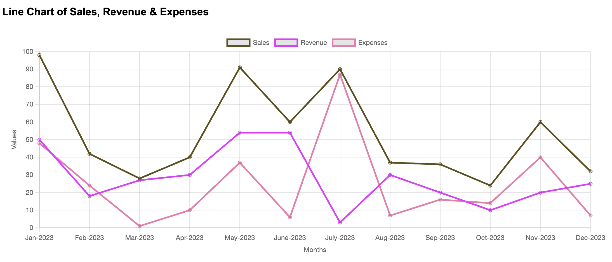
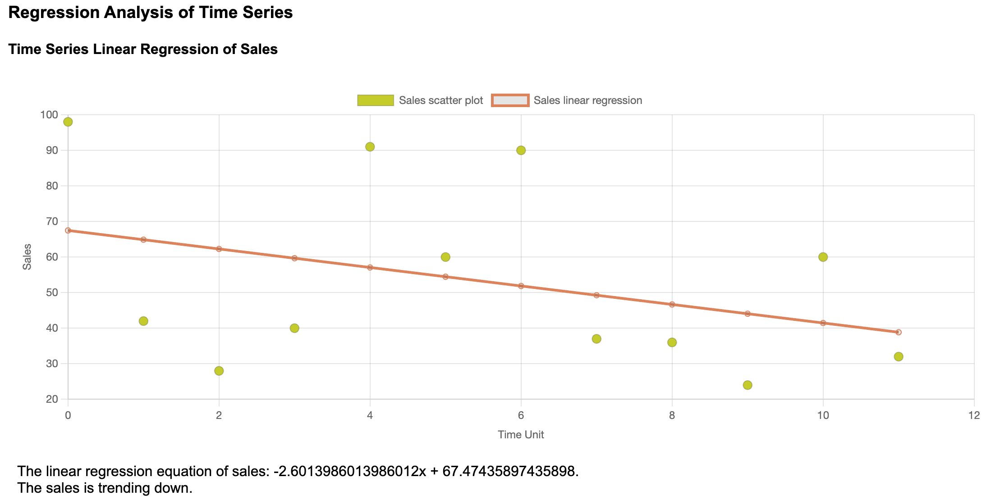
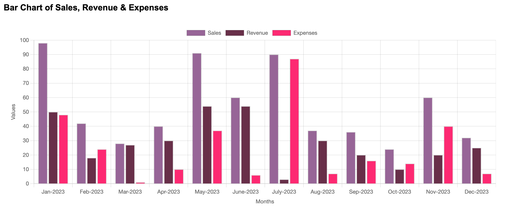
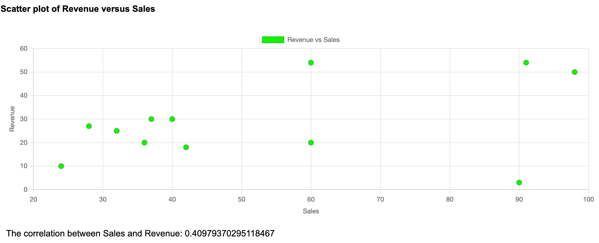

# financial-analysis-webapp

## Introduction
The tool is hosted on https://alfredphysarani.github.io/financial-analysis-webapp/. 
It has a the following functions:
* Generate line charts of sales, revenue and expenses
* Generate regression trendlines of the time series of the data
* Generate bar charts of sales, revenue and expenses
* Generate scatter plots of sales, revenue and expenses with correlation calculated

The tool only supports .xlsx format file.
The standard format of the Excel file consists of 4 columns:
* month
* sales
* revenue
* expenses

The sample.xlsx can be found in the repository.

## Examples
* Line charts of sales, revenue and expenses

* Regression trendlines

* Bar charts of sales, revenue and expenses

* Scatter Plots
